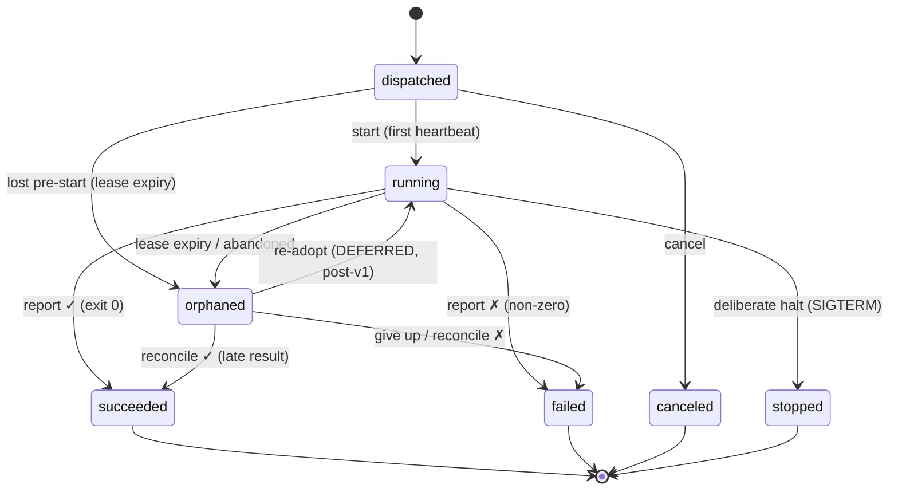
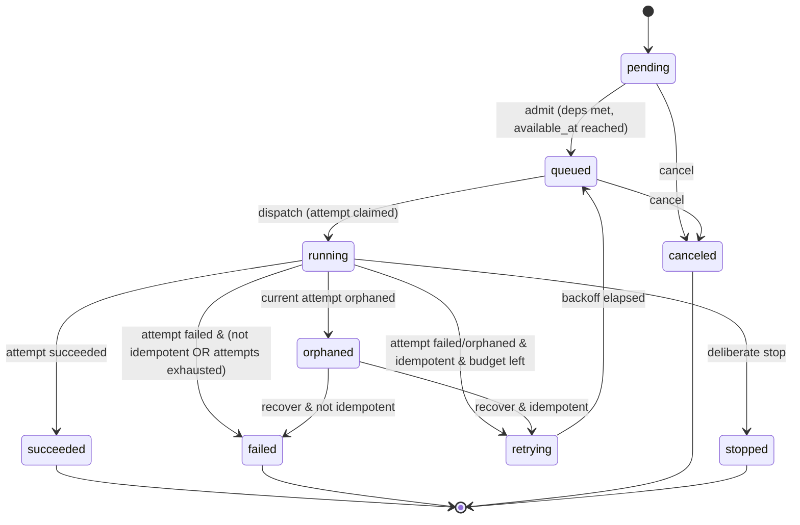

# JobWarden — Database-Backed Job & Batch System for Laravel

**Architecture Specification — v0.1 (draft)**
*Target: a reusable, installable Laravel package. Working name "JobWarden" is a placeholder.*
*Date: 2026-06-30*

---

## 0. Purpose & Scope

JobWarden is a durable, database-backed job, batch, and scheduling engine for Laravel. It is a deliberate alternative to the Redis/Horizon model: **the relational database is the source of truth and the coordination layer**, not a queue buffer. Correctness, recovery, and observability come from durable state transitions and idempotent execution — never from assuming a single long-running supervisor is healthy.

This document specifies the system at architecture depth across eight concerns: the durable job store, observability, Linux process management, scheduling, horizontal scalability, batches and dependencies, state transitions and auditability, and operations. It is built directly on the state machine designed prior to this spec, reproduced in §3.

### Non-goals (for v1)
- Replacing Laravel's `Bus`/`Queue` contracts for code that doesn't opt in. JobWarden coexists; it does not hijack `dispatch()`.
- A general workflow/DSL engine. Dependencies are a DAG, not a scripting language.
- Multi-language workers. Workers are PHP/Linux.

### 0.1 v1 Scope — mandatory vs deferred
This spec describes a fairly sophisticated distributed process orchestrator. To keep the implementation burden honest, v1 is fenced explicitly. **Everything below in this document is part of the design, but only the "mandatory" set must ship in v1.**

**Mandatory for v1:**
- Database-backed `jobs`, `job_attempts`, `batches`, and `schedules` as the source of truth.
- Child-process-per-job execution (the in-process mode is deferred).
- The process stamp: `host_id`, supervisor/child PID + per-PID start-time, and `proc_nonce`.
- Host heartbeat/lease for host-death detection.
- Local reaper (Tier 2) and global reaper (Tier 3) with a **database leader lease**.
- The state machine and `job_events` audit log.
- Structured `job_logs` (LogIndex) with a database body sink.
- Missed-run scheduler with `schedule_runs` and `UNIQUE(schedule_id, occurrence_time)`.
- Idempotency-gated automatic retry.

**Deferred / optional (post-v1):**
- Re-adoption of orphaned child processes (`orphaned → running`).
- In-process execution mode.
- Redis push signaling.
- The operator UI (CLI + the read tables suffice for v1).
- Complex dependency-satisfaction modes (v1 = strict: all deps `succeeded`).
- Advanced batch completion callbacks.
- External (disk/S3) log body sinks.

---

## 1. Design Principles

1. **Database is the source of truth.** Every fact needed to reconstruct system state — what jobs exist, their batch, their status, their owner, timings, logs, and artifacts — lives in durable tables. Redis, if present, is a cache/signal that can be rebuilt from the database and is never required for correctness.
2. **State transitions are the unit of record.** Current state is a denormalized column for fast queries; the append-only event log is the truth of *how it got there*. Every meaningful transition writes an event in the same transaction that moves the state.
3. **No per-job heartbeats from job code; liveness is verified, with a coarse host heartbeat only for host death.** While a host is alive, an attempt's liveness is the *verified existence* of its stamped processes — requiring no heartbeat cooperation from the job code itself (a busy single-threaded PHP job need do nothing). The system still uses one coarse **host heartbeat/lease** per host — that *is* a heartbeat, just not per job — and its expiry is the only timeout. Detection is partitioned into three tiers: a supervisor's `waitpid` over its own children (instant), a per-host **local reaper** that verifies stamps (host alive), and an HA **global reaper** that catches dead hosts via expired host leases — so the only timeout is for true host death, decoupled from job duration (a 4-hour job on a pulled-plug host is caught in ≈40s, not 4 hours).
4. **Idempotency is an explicit, observable job attribute.** It is the single guard that decides whether a lost or failed run may be restarted automatically (see §3).
5. **Observability is a first-class feature, not instrumentation.** Because the DB is authoritative, "what is happening" is answered by querying tables, not by scraping logs or polling a dashboard daemon.
6. **Explicit over magic.** Operators connect a DB row to a real Linux PID, see why a transition happened, and act with durable, auditable commands.

---

## 2. Package Shape

- **Composer:** `vendor/jobwarden` · **Namespace:** `JobWarden\` · **Config:** `config/jobwarden.php`
- **Tables:** prefixed and configurable; default prefix `jobwarden_`. The spec refers to them unprefixed in prose ("the `jobs` table") and prefixed in DDL.
- **Connection:** a dedicated DB connection name (`jobwarden.connection`) so the engine can run on its own database/replica topology, independent of the app's default connection.
- **Install:** `php artisan jobwarden:install` publishes config and migrations. `migrate` creates the schema.
- **ID strategy:** UUIDv7 primary keys by default (sortable, distributed generation, no central sequence). Configurable to bigint-snowflake. Event/log tables additionally carry a monotonic ordering column.

### Database engine requirements
The claim path relies on `SELECT … FOR UPDATE SKIP LOCKED`.

| Engine | Support | Notes |
|---|---|---|
| PostgreSQL ≥ 9.5 | Full | Recommended. `LISTEN/NOTIFY` available for push wakeups. |
| MySQL ≥ 8.0.1 | Full | `SKIP LOCKED` supported. |
| MariaDB ≥ 10.6 | Full | `SKIP LOCKED` supported. |
| Older MySQL/MariaDB | Fallback | Optimistic atomic-claim strategy (guarded `UPDATE`, see §5.2). Higher contention. |
| SQLite | Tests only | No real concurrency; single-writer. |

JobWarden detects the engine and selects the claim driver; the fallback is correct but trades throughput for compatibility.

---

## 3. Domain Model & State Machines

JobWarden is **two-level**: a logical **Job (Run)** owns a sequence of immutable **Attempts**. A retry is a *new* attempt; an attempt is bound to exactly one worker lease epoch. Jobs may belong to a **Batch**, which has its own lifecycle.

### 3.1 Why two levels
The Job carries the durable intent and verdict that outlive any single execution: identity/idempotency key, cross-attempt budget and policy, the externally observed terminal status, the reconciliation owner for lost work, and the "one live attempt at a time" invariant. The Attempt carries one worker-instance binding: PID, host, lease, heartbeat, exit code. `QUEUED`/`DISPATCHED` describe where work sits *right now*; the Job describes the intent and answers "did it ultimately succeed?".

### 3.2 Attempt states

| State | Meaning | Terminal |
|---|---|---|
| `dispatched` | Claimed and leased; child process being spawned, not yet confirmed running. | no |
| `running` | Child process confirmed live, heartbeating. | no |
| `succeeded` | Worker reported success (exit 0). Determinate. | yes |
| `failed` | Worker reported failure (non-zero exit / thrown). Determinate. | yes |
| `orphaned` | Owner lost (lease expired / declared abandoned). **Indeterminate** — outcome unknown. | re-enterable |
| `canceled` | Halted before active execution (from `dispatched`). | yes |
| `stopped` | Deliberately halted *while running*. | yes |

`orphaned` is a limbo, not an exit. It is set by the orchestrator/reaper, never by the worker, and bumps the fencing token. In **v1**, from `orphaned` an attempt may **reconcile** to `succeeded`/`failed` (a late/polled determinate result resolves the unknown) or be abandoned — after which the *Job* recovers by minting a fresh attempt (it does not resurrect this one). Any still-live stamped process is killed first (§5.4). The richer **re-adopt** edge (`orphaned → running`, reconnecting a new supervisor to a still-live child) is **deferred to post-v1** (§0.1) — it requires controlling a reparented PHP child from a new parent, which is hard to do safely. So the Job stays recoverable, but recovery is always a new attempt in v1, never re-attachment to the old process.



### 3.3 Job (Run) states

| State | Meaning | Terminal |
|---|---|---|
| `pending` | Created but not yet eligible (gated by `available_at`, dependencies, or schedule). | no |
| `queued` | Eligible; awaiting a worker claim. | no |
| `running` | A live attempt is executing. | no |
| `retrying` | Last attempt failed/orphaned; waiting out backoff before the next attempt. Modeled as `queued` with a future `available_at`, surfaced as a distinct status for operators. | no |
| `orphaned` | Current attempt was orphaned and recovery has not yet decided. Awaiting reaper/operator. | no |
| `succeeded` | An attempt succeeded. | yes |
| `failed` | Attempts exhausted or a non-retryable/​non-idempotent outcome. | yes |
| `canceled` | Intent withdrawn before active execution. | yes |
| `stopped` | Deliberately halted while running. | yes |



### 3.4 The idempotency guard
`jobs.idempotent` (boolean, observable) is the **only** guard on automatic restart.

- **`idempotent = true`** → after `failed` (within budget) or `orphaned`, the Job may auto-restart: it transitions `running|orphaned → retrying → queued` and a fresh attempt is minted. For idempotent work the determinate/indeterminate distinction is moot — re-running converges.
- **`idempotent = false`** → the restart edge does not exist. A dead or lost attempt drives the Job to `failed` (or `orphaned` parked for an operator). Even a `failed` report is treated as indeterminate, because a worker cannot prove it failed *before* an irreversible side effect. An operator may still force a restart with explicit, audited override.

> Distributed cancellation maps onto this machine directly: a pre-run withdrawal is `canceled`; a deliberate halt of active work is `stopped`. Both are operator-initiated terminals recorded with reason and actor.

### 3.5 Batch states
`pending → running → { succeeded | failed | partial | canceled | stopped }`. Batch completion is derived from member-job terminal states under the batch's failure policy (§7).

### 3.6 Transition guards and actors
Every transition is validated against an explicit table by the `StateMachine` service; illegal transitions raise and are never silently applied. Each row's *actor* is recorded in the event:

| Transition | Actor | Guard |
|---|---|---|
| `pending → queued` | scheduler / dependency resolver | deps satisfied; `available_at ≤ now` |
| `queued → running` (job) / claim → `dispatched`→`running` (attempt) | worker | successful claim with lease |
| `running → succeeded` | worker (via child exit 0) | fencing token current |
| `running → failed` | worker | fencing token current |
| `running → orphaned` (attempt) | local reaper (stamp gone) / global reaper (host lease expired) | owning process no longer verifiable, or host lease stale |
| `orphaned → retrying` (job) | reaper/recovery | `idempotent = true` AND `attempt_count < max_attempts` |
| `orphaned → failed` (job) | reaper/recovery | `idempotent = false` OR budget exhausted |
| `* → canceled` | operator | job not yet `running` |
| `running → stopped` | operator | confirmed termination of the live attempt |

---

## 4. Data Model / Schema

All tables use the configured prefix (default `jobwarden_`) and the dedicated connection. Timestamps are `timestamptz`/microsecond where the engine supports it.

### 4.1 `batches`
```
id              uuid pk
name            varchar
type            varchar            -- logical batch type / coordinator class
state           varchar            -- pending|running|succeeded|failed|partial|canceled|stopped
failure_policy  varchar            -- fail_fast|continue|threshold
failure_threshold int null         -- for threshold policy (max tolerated failures)
params          json
summary         json null          -- batch-level results/artifacts pointer
total_jobs      int default 0
pending_count   int default 0
running_count   int default 0
succeeded_count int default 0
failed_count    int default 0
canceled_count  int default 0
created_by      varchar null
created_at, started_at, finished_at, updated_at
```
Progress counters are maintained transactionally on member-job transitions (or recomputed via aggregate query for correctness checks). Index: `(state)`.

### 4.2 `jobs` (the Run)
```
id                 uuid pk
batch_id           uuid null fk -> batches
schedule_id        uuid null fk -> schedules
job_class          varchar            -- handler resolved from the container
name               varchar null
params             json               -- inputs/context, captured for support review
idempotent         boolean default false   -- THE guard (§3.4)
idempotency_key    varchar null            -- dedupe key for logical intent
priority           smallint default 0
state              varchar            -- pending|queued|running|retrying|orphaned|succeeded|failed|canceled|stopped
available_at       timestamptz        -- not claimable before this (schedule/backoff/deps)
max_attempts       int default 1
attempt_count      int default 0
current_attempt_id uuid null fk -> job_attempts
max_runtime_sec    int null           -- expected runtime ceiling for stuck detection
backoff_strategy   varchar null       -- fixed|exponential|custom (+ base/cap in params)
cancel_requested   boolean default false   -- desired-state flag for distributed cancel/stop
cancel_mode        varchar null            -- cancel|stop
cancel_reason      varchar null
cancel_requested_at timestamptz null
last_error         json null
result             json null
tags               json null
created_by         varchar null
created_at, queued_at, started_at, finished_at, updated_at
```
Claim index (partial where supported): `(state, available_at, priority desc)` filtered on `state = 'queued'`. Lookup indexes: `(batch_id)`, `(schedule_id)`, unique `(idempotency_key)` where not null.

### 4.3 `job_attempts` (the Attempt)
The attempt carries a **process stamp** — the verifiable identity of the OS processes that own this execution. It is written in two phases (§5.2): the supervisor identity at claim, the child identity once spawned.
```
id                    uuid pk
job_id                uuid fk -> jobs
attempt_number        int
state                 varchar       -- dispatched|running|succeeded|failed|orphaned|canceled|stopped
worker_id             uuid null fk -> workers
fencing_token       bigint        -- monotonic per job; the fencing epoch. Stamped; stale-token writes are rejected.
-- process stamp (host_id + supervisor at claim; child after spawn) --
host_id               varchar null  -- BOOT-STABLE id (machine-id + boot_id), NOT the hostname
hostname              varchar null  -- human-readable only
supervisor_pid        int null
supervisor_start_time bigint null   -- /proc starttime ticks — reuse-proofs supervisor_pid
child_pid             int null       -- the jobwarden:run job process
child_start_time      bigint null   -- reuse-proofs child_pid
proc_nonce            varchar null  -- random per-process id, advertised via pidfile + proctitle
-- timing & outcome --
started_at            timestamptz null
finished_at           timestamptz null
exit_code             int null
term_signal           int null      -- signal that terminated the process, if any
duration_ms           bigint null
progress              json null      -- structured progress counters
error                 json null      -- class, message, trace reference
created_at, updated_at
```
Indexes: `(job_id, attempt_number)` unique; **local-reaper** scan `(host_id, state)` filtered on `state in ('dispatched','running')`; the **global reaper** orphans by `host_id` once a host's lease expires. The per-attempt liveness lease lives on the owning host row (`workers.heartbeat_at`, §4.9), not here — there is one host lease, not one per job.

### 4.4 `job_events` (append-only audit)
```
id            bigint pk (monotonic)
job_id        uuid fk
attempt_id    uuid null fk
level         varchar            -- job|attempt|batch
from_state    varchar null
to_state      varchar
actor_type    varchar            -- worker|scheduler|reaper|operator|system
actor_id      varchar null       -- worker id / user id
reason        varchar null
context       json null          -- error context, process snapshot, fencing token
created_at    timestamptz (indexed)
```
This is the "how it got there" record. Never updated, only inserted, in the same transaction as the state change.

### 4.5 `job_logs` — a LogIndex over a pluggable LogBodySink
Logs are split into an **index** (always in the DB) and a **body sink** (pluggable) from day one, so high-volume jobs cannot turn `job_logs` into the hottest, largest table in the system. The index row is small and queryable; the body can live inline or be offloaded.

`job_logs` is the **LogIndex**:
```
id          bigint pk
job_id      uuid fk
attempt_id  uuid fk
seq         bigint             -- monotonic per attempt; ordered tailing cursor
ts          timestamptz(6)
level       varchar            -- debug|info|notice|warning|error|critical
step        varchar null       -- named step within the job
context     json null          -- external_request_id, response_summary, counters, etc.
body_sink   varchar            -- database|disk|s3|custom
body_ref    text null          -- inline message (database sink) OR a pointer/key (disk/s3)
created_at  timestamptz
```
The **LogBodySink** is an interface with implementations `database` (body inline in `body_ref`, the v1 default), `disk`, `s3`, and `custom`. Tailing and export read the index by `(attempt_id, seq)` and resolve bodies through the sink. Indexes: `(attempt_id, seq)`, `(job_id, ts)`. Logs are written *during* execution (see §6.4), not only on completion. Retention/pruning is policy-driven (§10), and offloaded bodies can age out independently of the index.

### 4.6 `job_artifacts`
```
id           uuid pk
job_id       uuid fk
attempt_id   uuid null fk
type         varchar            -- file|request|response|report|dump
name         varchar
disk         varchar            -- Laravel filesystem disk
path         varchar            -- or url
size_bytes   bigint null
checksum     varchar null
content_type varchar null
meta         json null
created_at
```
Request/response artifacts make support-case review possible: the exact outbound request and the response summary tied to a job and attempt.

### 4.7 `schedules`
```
id                  uuid pk
name                varchar unique
job_class           varchar
params              json
kind                varchar            -- recurring|one_time
cron_expression     varchar null
run_at              timestamptz null   -- one-time
timezone            varchar default 'UTC'
enabled             boolean default true
missed_policy       varchar            -- run_latest|run_all|skip|coalesce
catch_up_window_sec int null           -- ignore occurrences older than now - window
max_catch_up        int null           -- cap number of catch-up jobs per evaluation
overlap_policy      varchar            -- allow|skip|queue
priority            smallint default 0
owner               varchar null
tags                json null
last_evaluated_at   timestamptz null
last_enqueued_for   timestamptz null   -- most recent occurrence materialized
next_due_at         timestamptz null
created_at, updated_at
```

### 4.8 `schedule_runs` (evaluation & occurrence audit)
```
id                uuid pk
schedule_id       uuid fk -> schedules
occurrence_time   timestamptz        -- the scheduled instant this represents
detected_at       timestamptz        -- when an evaluator noticed it
action            varchar            -- enqueued|skipped|coalesced|overlapped|outside_window
job_id            uuid null fk -> jobs
reason            varchar null
evaluator_worker_id uuid null
created_at
UNIQUE (schedule_id, occurrence_time)     -- idempotent materialization (key invariant)
```
The unique constraint is the lynchpin of multi-scheduler safety: every occurrence materializes **at most once**, regardless of how many schedulers evaluate concurrently or how often evaluation retries.

### 4.9 `workers` (process registry — supervisors, schedulers, reapers, local reapers)
```
id             uuid pk
role           varchar            -- supervisor|scheduler|global_reaper|local_reaper
host_id        varchar            -- BOOT-STABLE id (machine-id + boot_id)
hostname       varchar            -- human-readable
pid            int
incarnation    bigint             -- monotonic; new on every (re)start; fences a rebooted host
state          varchar            -- starting|active|draining|stopped|dead
capacity       int null           -- max concurrent jobs (supervisors)
current_load   int default 0
app_version    varchar null
php_version    varchar null
meta           json null
started_at     timestamptz
heartbeat_at   timestamptz        -- the HOST LEASE: the one coarse liveness signal the global reaper watches
stopped_at     timestamptz null
last_signal    varchar null
```
Index: `(state, heartbeat_at)` for the global reaper's expiry scan. `heartbeat_at` is the **host-level lease** — refreshed against the DB clock by the host's local reaper (§5.4), not per job. When it is stale beyond the budget, the global reaper declares the host `dead` and orphans every attempt stamped with that `host_id`.

### 4.10 `job_dependencies` (DAG edges)
```
job_id            uuid fk -> jobs
depends_on_job_id uuid fk -> jobs
PRIMARY KEY (job_id, depends_on_job_id)
```
A job is admitted (`pending → queued`) only when **all** `depends_on` jobs are `succeeded` (or satisfy the configured dependency mode, e.g. allow-on-skip). This implements the Job machine's admit gate for chains and dependent jobs.

---

## 5. Coordination & Concurrency

The system scales across processes and hosts. Correctness rests on four primitives: atomic claims, **process stamps** (verifiable OS-process identity), a coarse **host lease**, and per-job **execution tokens** (fencing). Liveness is established two ways — directly verified while a host is alive (local reaper), inferred from an expired host lease only when it is not (global reaper).

### 5.1 Claiming (preferred: `SKIP LOCKED`)
A worker with spare capacity claims one (or a small batch of) eligible jobs in a single transaction:

```sql
BEGIN;
SELECT id
  FROM jobwarden_jobs
 WHERE state = 'queued'
   AND available_at <= now()
 ORDER BY priority DESC, available_at ASC
 LIMIT 1
 FOR UPDATE SKIP LOCKED;

-- For the locked row, in the same transaction (PHASE 1 of the stamp):
--  * insert job_attempts (attempt_number = attempt_count+1,
--                         fencing_token = attempt_count+1,
--                         worker_id, host_id, hostname, supervisor_pid, supervisor_start_time,
--                         state = 'dispatched')   -- child_pid not known yet
--  * update jobs set state='running', current_attempt_id=?, attempt_count=attempt_count+1, started_at=coalesce(started_at, now())
--  * insert job_events (queued -> running, actor=supervisor)
COMMIT;

-- PHASE 2 (right after proc_open returns the child):
--  UPDATE job_attempts SET child_pid=?, child_start_time=?, proc_nonce=?
--   WHERE id=? AND fencing_token=?;     -- completes the stamp
```
`SKIP LOCKED` guarantees two supervisors never claim the same row — the second skips it. This is the core of "no duplicate job ownership." The stamp is two-phase because `child_pid` does not exist until the child is spawned; the local reaper tolerates the `dispatched` window (supervisor stamped, child pending) and verifies only what is present.

### 5.2 Fallback claim (engines without `SKIP LOCKED`)
An optimistic guarded update; success is proven by affected-row count:
```sql
UPDATE jobwarden_jobs
   SET state='running', current_attempt_id=:newAttempt, attempt_count=attempt_count+1
 WHERE id = :candidateId AND state='queued';
-- affected rows = 1 → we own it; = 0 → someone beat us, pick another candidate
```
Candidates are selected with `ORDER BY ... LIMIT N` first, then contended for. Correct but higher contention under load.

### 5.3 Liveness without per-job heartbeats
JobWarden **does not require per-job heartbeats from job code.** It establishes job liveness by *verifying the owning processes directly* while the host is alive, and uses a single coarse **host heartbeat/lease** only for host-death detection. (The host lease *is* a heartbeat — one per host, written by the local reaper, not by job code — so this is "no per-job heartbeat," not "no heartbeat anywhere.") The motivation is single-threaded PHP: a busy or blocked process can't reliably beat, so heartbeat-per-job would falsely reap healthy long jobs.

- **The process stamp.** Each attempt records the verifiable identity of its owning processes: `host_id` (boot-stable: `machine-id` + `boot_id`, *not* the hostname, which can be reused on a reimaged box), `supervisor_pid` + `supervisor_start_time`, `child_pid` + `child_start_time`, and a `proc_nonce` (random per-process id). Start-time is captured **per PID** because PIDs recycle — `(pid, start_time)` is a reuse-proof local identity, while `pid` alone is not. The child advertises its `proc_nonce` via a pidfile keyed by `attempt_id` and via its process title (`cli_set_process_title`, which also makes `ps` readable for operators), so verification confirms *this attempt's* process, not merely *a* live PID.
- **Direct verification (host alive).** A live process is checked locally: PID exists and `/proc/<pid>` start-time + `proc_nonce` match the stamp. This requires **no heartbeat cooperation from the job code itself** — a CPU-bound 4-hour job is verifiably alive while doing zero liveness work. (It says nothing about *progress*, graceful cancellation, or side-effect safety — those are separate, see below and §11a.) PIDs are host-local, so this check only works *on the same host* (§5.4, local reaper).
- **The host heartbeat/lease (host dead).** One coarse signal per host (`workers.heartbeat_at`), refreshed against the **DB clock** to avoid cross-host clock skew. Its absence is the only timeout in the system, and it exists solely to catch hosts that can no longer verify themselves (power loss, panic, partition).
- **Fencing token.** `fencing_token` is a monotonic per-job **epoch**, incremented on every orphan/reclaim. Every state-changing write carries the current token; a stale-token write — a zombie that wakes after a GC pause, or a partitioned worker reconnecting — is rejected and recorded as a reconciliation event rather than clobbering state. This enforces **at most one *database-authoritative* attempt per job**. It does **not** guarantee only one physical process is running: a partitioned or isolated host can keep executing side effects until it self-fences (§5.4), so non-idempotent jobs remain indeterminate until reconciled (§11a). `proc_nonce` is the unrelated random process identity used for stamp verification; the two are distinct (epoch vs identity).
- **Progress is separate.** Optional progress updates (and `max_runtime_sec`) detect a process that is alive and verified but *not advancing* → surfaced as **stuck**, a distinct condition handled by an operator, never auto-reaped.

### 5.4 Three tiers of detection — two reapers

Death is detected at three levels, partitioned by "is the host still talking to the DB." The boundary is clean: **while a host's lease is fresh, its local reaper is authoritative (verify processes directly); once the lease expires, the global reaper takes over and the `fencing_token` fences the old host out.**

**Tier 1 — the supervisor's own children (instant, reported).** A supervisor `waitpid`s the children it spawned, so it catches their death event-driven, *with the exit code*: a crash/OOM becomes `failed`, a post-`SIGTERM` exit becomes `stopped`. This is the primary, richest child-death path — no timeout, no scan.

**Tier 2 — the local reaper (host alive, seconds).** A **separate, supervised per-host process** (not a supervisor — so it can detect a *dead supervisor*, whose children just reparented to init). Each scan it verifies every attempt stamped to its `host_id`:
```sql
-- candidates: my host's in-flight attempts
SELECT id, supervisor_pid, supervisor_start_time, child_pid, child_start_time, proc_nonce
  FROM jobwarden_job_attempts
 WHERE host_id = :this_host AND state IN ('dispatched','running');
-- For each: confirm PID alive AND /proc start-time matches AND nonce matches.
```
Outcomes per attempt:
- **Child gone, supervisor alive** → normally already handled by Tier 1 (`waitpid`); the local reaper orphans it as a backstop.
- **Supervisor gone, child gone** → the execution is over; orphan and recover.
- **Supervisor gone, child still alive** (reparented to init) → the dangerous case. **v1 policy: the local reaper `SIGTERM`s then `SIGKILL`s the stamped child, confirms it is dead, and only then marks the attempt `orphaned`.** It does *not* re-adopt the child into a new supervisor (deferred, §0.1), and it does *not* mint a replacement attempt while the old child is still running — that is what would cause duplicate side effects.

It also **refreshes the host lease** (`workers.heartbeat_at = DB now()`) and runs under systemd `Restart=always` + `WatchdogSec` so a wedged local reaper is restarted locally and fast.

**Tier 3 — the global reaper (host dead, the only timeout).** **Multiple global-reaper processes may be deployed; exactly one is active at a time by holding a database-backed leader lease** (a single row updated with `WHERE lease_expires_at < now()`, refreshed by the holder; if the holder dies the lease expires and another process acquires it). Only the leader performs the cross-host scan, which is why there is no reaper-vs-reaper contention. It watches host leases; PIDs are useless across hosts, so a dead/partitioned host can only be caught by its host lease going stale:
```sql
-- 1) declare hosts dead whose lease expired (DB-clock comparison — no cross-host skew)
UPDATE jobwarden_workers SET state='dead'
 WHERE role='local_reaper' AND state='active'
   AND heartbeat_at < now() - (:missed_beats * :heartbeat_interval);

-- 2) orphan every attempt stamped to those hosts, in one stroke (bumps each fencing_token)
UPDATE jobwarden_job_attempts SET state='orphaned', fencing_token = fencing_token + 1
 WHERE state IN ('dispatched','running')
   AND host_id IN ( /* the hosts just declared dead */ );
```
Because only one reaper does cross-host work, there is no reaper-vs-reaper contention; Tier 2 is partitioned by `host_id`, so local reapers never collide either.

**The partition hazard (network isolation).** An isolated-but-alive host passes Tier 2 (its processes are genuinely running) yet fails Tier 3 (its lease can't reach the DB) — so the global reaper hands its jobs elsewhere while it may still be running them. Two defenses: (a) `fencing_token` fencing rejects the isolated host's writes once the partition heals, protecting DB state; and (b) the local reaper **self-fences** — if it cannot refresh its host lease within the TTL, it `SIGKILL`s its children, assuming it has already been reaped — bounding the duplicate *side-effect* window. For non-idempotent jobs this still lands in the indeterminate/reconcile bucket: fencing protects the database, not the outside world.

**Stuck (not dead).** A `running` attempt that verifies alive but has `now - started_at > max_runtime_sec` (or stale progress) is flagged for operator attention — never auto-orphaned.

**Recovery decision** (per orphaned job, by whichever reaper orphaned it): if `idempotent = true` and `attempt_count < max_attempts`, `orphaned → retrying` (`available_at = now + backoff`) → `queued`, minting a fresh attempt. Otherwise `orphaned → failed` with the reason recorded — or *park* in `orphaned` for explicit operator restart, per config.

### 5.5 Multi-scheduler safety
Schedulers contend per-schedule, not globally, using `FOR UPDATE SKIP LOCKED` on the `schedules` row (or a Postgres advisory lock keyed by `schedule_id`) for the duration of one evaluation. Combined with `UNIQUE(schedule_id, occurrence_time)` on `schedule_runs`, concurrent schedulers cannot double-enqueue an occurrence even if they evaluate the same schedule simultaneously.

---

## 6. Linux Process Management

JobWarden models execution around **real Linux PHP processes** and exposes enough information to connect a DB row to a live PID.

### 6.1 Execution model — supervisor + per-job child
`php artisan jobwarden:work` is a **supervisor**, not the job runner. For each claimed job it spawns a dedicated child:
```
php artisan jobwarden:run {attempt_id} --token={fencing_token}
```
via `proc_open`/`pcntl`. The child executes the job handler in isolation, writes a pidfile keyed by `attempt_id`, and sets its process title to include the attempt id. This gives:
- **A verifiable stamp** — the attempt row records `host_id` + the child's `child_pid`, `child_start_time`, `proc_nonce`, so any local reaper can confirm *this attempt's* process is alive (§5.3).
- **Fault isolation** — an OOM kill or fatal error takes down one job, not the supervisor or its siblings.
- **True exit semantics** — the supervisor `waitpid`s the child and records `exit_code` and `term_signal` (Tier 1, §5.4).

A lighter **in-process mode** (run the handler inside the worker loop) is available via config for low-overhead, trusted workloads, at the cost of isolation and per-job PID granularity. Child-process mode is the default and the recommended production model.

### 6.2 Lifecycle and signals

| Event | Mechanism | Resulting transition |
|---|---|---|
| Start job | supervisor spawns child, records pid | attempt `dispatched → running` |
| Job completes | child exits 0 | attempt `running → succeeded`; job `running → succeeded` |
| Job errors | child exits non-zero / throws | attempt `running → failed`; job → `retrying` or `failed` |
| Graceful cancel/stop | supervisor sends `SIGTERM` to child; handler runs shutdown hook | attempt `running → stopped`/`canceled` |
| Forced termination | `SIGKILL` after grace period | attempt `stopped`; `term_signal = 9` recorded |
| Child crash / OOM (host alive) | **Tier 1**: supervisor `waitpid` (instant, with exit code) | attempt `running → failed` |
| Stalled (alive but wedged) | stamp verifies alive, but no progress / over `max_runtime_sec` | flagged **stuck** (not orphaned) |
| Supervisor dies (host alive) | **Tier 2**: local reaper finds reparented children via stamp (seconds) | that supervisor's attempts → `orphaned` |
| Supervisor graceful shutdown | supervisor catches `SIGTERM` → `state=draining`, stops claiming, drains children | worker `active → draining → stopped` |
| Host power loss / panic / partition | **Tier 3**: global reaper, host lease expired (≤ ~40s) | all attempts stamped to that `host_id` → `orphaned` |
| Network isolation (host alive) | Tier 3 reaps remotely; local reaper **self-fences** (SIGKILLs children) | `orphaned` + `fencing_token` fences late writes |

### 6.3 Distributed cancellation (no direct process access needed)
Cancellation is **desired-state in the database**, so it works across hosts:
1. Operator sets `jobs.cancel_requested = true`, `cancel_mode = cancel|stop`, with reason.
2. The owning supervisor observes the flag (on its heartbeat/poll loop, or via an optional Redis signal) and signals its child: `SIGTERM`, then `SIGKILL` after the grace window.
3. If there is **no live owner** (the worker is dead), the reaper resolves it: the lease expires, the attempt is orphaned, and the cancellation desired-state is honored on recovery.

Graceful jobs implement a shutdown hook (`onTerminate()`), giving them a window to checkpoint/clean up before forced kill.

### 6.4 Log capture during execution
The child writes structured log records and progress **directly to `job_logs`/`job_attempts`** as it runs (buffered, batched inserts to bound write amplification). Because logs land in the DB live, operators tail running jobs by polling `WHERE attempt_id = ? AND seq > :cursor`. An optional Redis pub/sub channel per attempt provides low-latency push; the DB remains authoritative.

---

## 7. Scheduling

A durable scheduler comparable to or better than Laravel Scheduler, with **missed-run detection** as a first-class requirement.

### 7.1 Evaluation loop
`php artisan jobwarden:schedule` registers as a `scheduler` worker and ticks every `tick_interval` (e.g., 1–10s). Per tick, for each enabled schedule it can claim (§5.5):

1. Compute all occurrences in the window `(last_evaluated_at, now]` from `cron_expression` + `timezone` (or the single `run_at` for one-time). **If the scheduler was down, `last_evaluated_at` is stale and multiple occurrences are computed — this is missed-run detection.**
2. Apply `missed_policy`:
   - **`run_all`** — one job per occurrence, subject to `catch_up_window_sec` and `max_catch_up`.
   - **`run_latest`** — only the most recent occurrence.
   - **`skip`** — none; just advance `last_evaluated_at`.
   - **`coalesce`** — collapse multiple missed occurrences into a single job; others recorded as `coalesced`.
3. Apply `overlap_policy` against still-running jobs from this schedule: `allow` | `skip` | `queue`.
4. Materialize each chosen occurrence: `INSERT schedule_runs(schedule_id, occurrence_time, action)`. The unique constraint makes this idempotent — a losing race simply no-ops. On success, create the job (`available_at = occurrence_time` or `now`) and link `job_id`.
5. Update `last_evaluated_at = now`, `next_due_at = next occurrence`.

### 7.2 Auditability
Every decision is durable and inspectable: `schedules.last_evaluated_at`, the `schedule_runs` rows (each occurrence, when detected, the action taken, the reason, and the resulting `job_id`), and the linked job events. An operator can answer "was this missed run caught up, and if not, why?" entirely from tables.

### 7.3 One-time jobs
`kind = one_time` with `run_at`. Evaluated identically; once materialized (a `schedule_runs` row exists) it never re-fires. Disabling sets `enabled = false`; evaluation skips it and records nothing.

---

## 8. Batches & Dependencies

A batch is a first-class object with its own lifecycle, params, progress, summary, and artifacts, while each member job remains independently inspectable.

### 8.1 Topologies
- **Fan-out** — N independent jobs under one batch; progress = counts by state.
- **Chain** — linear `job_dependencies` edges; each step admitted only when its predecessor succeeds.
- **DAG / dependent jobs** — arbitrary `depends_on` edges; a job is admitted when all dependencies are satisfied.

### 8.2 Failure handling
`batches.failure_policy`:
- **`fail_fast`** — first member failure cancels remaining `pending`/`queued` members and fails the batch.
- **`continue`** — run all members regardless; batch ends `partial` if some failed, `succeeded` if all succeeded.
- **`threshold`** — tolerate up to `failure_threshold` failures before failing the batch.

### 8.3 Progress, completion, and artifacts
Member transitions update the batch's denormalized counters in-transaction. When all members reach a terminal state, the batch coordinator runs **completion logic** (success/failure/partial determination + an optional batch-completion callback) and writes a batch `summary` and any batch-level artifacts. Cancellation propagates: canceling a batch sets `cancel_requested` on all non-terminal members.

### 8.4 Retryable steps
Per-job `max_attempts`/`idempotent`/`backoff` apply within a batch exactly as for standalone jobs; a transient step failure retries without failing the batch, subject to the batch policy.

---

## 9. Observability & Logging

Because the database is authoritative, observability is **queries over durable tables**, not a separate telemetry system. JobWarden ships read models (Eloquent scopes, query objects, and optional DB views) and an operator façade.

### 9.1 Core operator questions → read models

| Question | Source |
|---|---|
| What is running right now? | `jobs.state='running'` joined to `current_attempt` (pid, host, heartbeat). |
| What is waiting? | `state in ('pending','queued','retrying')` with `available_at`. |
| What failed and why? | `state='failed'` + `last_error` + the failing attempt's `error` and logs. |
| Which process owns this job? | `current_attempt.worker_id`, `pid`, `hostname`. |
| Is it alive or orphaned? | `attempt.state` + stamp verification (PID/start-time match); host lease (`workers.heartbeat_at`) freshness. |
| Stuck beyond expected runtime? | `running` AND `now - started_at > max_runtime_sec`. |
| What has it logged so far? | `job_logs WHERE attempt_id = ? ORDER BY seq`. |
| What inputs/context were used? | `jobs.params`, request/response `job_artifacts`. |
| Scheduler health? | `workers` role=`scheduler` heartbeat freshness; `schedules.last_evaluated_at` staleness. |
| Were missed runs caught up? | `schedule_runs` recent actions per schedule. |

### 9.2 Structured logs and artifacts
Logs are first-class: structured records with `ts`, `level`, `step`, `message`, and a `context` JSON (external request IDs, response summaries, progress counters, error details), alongside human-readable messages. Artifacts capture files, dumps, and request/response pairs for support-case review. Both are retained per policy and exportable.

### 9.3 Live tailing and export
- **Live tail** — poll `job_logs` by `seq` cursor; optional Redis push for sub-second latency.
- **Export** — `jobwarden:logs {job} --export` streams an NDJSON bundle of the job's events, logs, params, and request/response artifacts for a support case.
- **Optional UI** — the package can ship a thin read-only operator UI (Livewire/Inertia) over the façade; it is optional and adds nothing the queries can't already answer.

---

## 10. Operations

### 10.1 Operator actions (durable, audited)
Exposed via a service façade, Artisan commands, and the optional UI:
- **Cancel** a job (pre-run) → `canceled`.
- **Stop** a running job → `stopped` (graceful then forced).
- **Retry** a failed job → mint a new attempt (warns and requires confirmation if `idempotent = false`).
- **Restart** an orphaned job → explicit override, audited, even for non-idempotent jobs.
- **Pause/resume** a schedule (`enabled` toggle); **re-prioritize** or **requeue** a job.
- **Prune** old jobs/logs/events per retention policy.

Every action writes a `job_events` row with `actor_type='operator'`, the actor id, and a reason.

### 10.2 Artisan commands

| Command | Role |
|---|---|
| `jobwarden:install` | Publish config + migrations. |
| `jobwarden:work` | Per-host supervisor (claims jobs, spawns + `waitpid`s children = Tier 1). |
| `jobwarden:run {attempt} --token` | Internal job-runner child (not called directly; writes pidfile + proctitle). |
| `jobwarden:reap:local` | Per-host **local reaper** (Tier 2): verifies stamps, refreshes the host lease, self-fences on isolation. systemd `Restart=always` + watchdog. |
| `jobwarden:reap:global` | The single HA **global reaper** (Tier 3): declares dead hosts via expired leases, orphans their attempts, runs recovery. |
| `jobwarden:schedule` | Scheduler loop (durable, multi-instance safe). |
| `jobwarden:status` / `:jobs` / `:batch {id}` | Operator inspection. |
| `jobwarden:logs {job} [--follow] [--export]` | Tail/export logs. |
| `jobwarden:cancel` / `:stop` / `:retry` / `:restart {job}` | Operator actions. |
| `jobwarden:prune` | Retention cleanup. |

### 10.3 Configuration (`config/jobwarden.php`)
Connection & `table_prefix`; ID strategy; host-lease `heartbeat_interval` (default 10s) and `missed_beats` (default 3) — together the host-down detection budget (≈40s, independent of job runtime, the *only* timeout); `local_scan_interval` (Tier 2 stamp-verification cadence); `self_fence_ttl` (when a local reaper kills its children on lost connectivity); `claim_batch_size`; default `max_attempts` + backoff; `max_runtime_sec` / progress-stale thresholds for stuck detection; scheduler `tick_interval` and default `missed_policy`/`overlap_policy`; supervisor default `capacity` and execution mode (child vs in-process); log retention days; optional Redis signaling (`enabled`, connection, channels).

### 10.4 Runbook scenarios (all recover from durable state)
- **Plug pulled on a host running a 4-hour job** (Tier 3) → the host lease stops refreshing; the global reaper declares the host dead and orphans every attempt stamped to that `host_id` within the budget (≈40s, *not* 4 hours) → idempotent jobs auto-retry elsewhere; non-idempotent jobs park for operator restart.
- **A child crashes / OOMs, host still up** (Tier 1) → the supervisor `waitpid`s it and records `failed` with the exit code immediately; no timeout, no scan.
- **A supervisor dies, host still up** (Tier 2) → its children reparent to init; the local reaper finds them via the stamp within `local_scan_interval` and orphans them.
- **A host is network-partitioned but alive** → the global reaper reaps it remotely; the local reaper, unable to refresh its lease within `self_fence_ttl`, `SIGKILL`s its own children; `fencing_token` rejects any late writes when the partition heals.
- **Scheduler was down for an hour** → on restart, the evaluation window detects missed occurrences and applies each schedule's `missed_policy`; `schedule_runs` shows exactly what was caught up or skipped.
- **A job wedges** (process alive and stamp-verified, no progress) → flagged **stuck** (not orphaned) and surfaced to an operator, even though a PID exists.
- **Duplicate-ownership attempt** → impossible under `SKIP LOCKED` + `fencing_token` fencing; a stale-token write is rejected and recorded as a reconciliation event.

---

## 11. State Transitions & Auditability (guarantee)

A single `StateMachine` service is the **only** path that mutates `jobs.state`/`job_attempts.state`. It:
1. Validates the transition against the explicit table (§3.6); illegal transitions throw.
2. In one DB transaction: updates the state column, writes the `job_events` row (`from`, `to`, `ts`, `actor`, `reason`, `context` incl. process snapshot + fencing token), and updates derived counters (batch progress).
3. Emits a Laravel event for listeners (metrics, notifications) *after commit*.

This yields the auditability requirement: the system can always explain not just the current state but the full causal history.

---

## 11a. Side Effects, Idempotency, and Reconciliation

The entire design turns on one uncomfortable fact: **a failed or orphaned attempt does not prove that external side effects did not occur.** A worker can charge a card, then crash before recording success; a partitioned host can keep shipping orders until it self-fences. Fencing tokens protect the *database* from conflicting writes — they do not, and cannot, undo an effect that already left the building. This section makes the consequences explicit so implementers don't quietly assume "failed means nothing happened."

**The rule.** Automatic retry is allowed **only** for jobs marked `idempotent = true` (§3.4). For idempotent jobs, re-execution converges regardless of what a lost attempt did, so `orphaned`/`failed` can auto-recover freely. For non-idempotent jobs, a lost attempt is **indeterminate**: the safe default is to leave the Job parked in `orphaned`/`failed` for operator review rather than auto-retry into a possible double effect.

**What database-authoritative vs physical means here.** `fencing_token` guarantees at most one *database-authoritative* attempt per Job. It does **not** guarantee a single physical execution: during a network partition the isolated host may keep running until `self_fence_ttl` kills it. So duplicate side effects are possible in exactly that window, and non-idempotent jobs stay indeterminate until reconciled. Fencing protects the DB; it does not protect the outside world.

**What jobs that touch external systems should record.** To make reconciliation possible rather than guesswork, such jobs should persist, as logs/artifacts on the attempt:
- an **external idempotency key** (so the downstream itself dedupes a retry — the strongest mitigation),
- **request/response artifacts** (the exact outbound request and a response summary, tied to `attempt_id`),
- **reconciliation hints** — the external entity id, a status-check endpoint, or a cursor — enough for a reconciler to ask the downstream "did this actually happen?"

**Reconciliation paths.** When an attempt is `orphaned`, the Job resolves it one of three ways:
1. **Auto** — `idempotent` jobs simply mint a new attempt.
2. **Job-specific reconciler** — a non-idempotent job may supply a reconciler that queries the external system using the recorded hints and drives `orphaned → succeeded` or `orphaned → failed` deterministically (this is the `reconcile` edge in §3.2).
3. **Operator review** — absent a reconciler, the Job parks; an operator inspects the attempt's request/response artifacts and last progress, then chooses retry, fail, or manual resolution.

The honest summary: JobWarden makes the *unknown* explicit and auditable, and gives non-idempotent work the hooks to become knowable. It does not pretend the unknown away.

---

## 12. Extensibility & the Optional Redis Layer

Redis is never required for correctness, recovery, or observability. When present it is a pure optimization/signaling layer, rebuildable from the DB:
- **Push wakeups** — notify idle workers that a job was enqueued, replacing/augmenting poll latency (Postgres `LISTEN/NOTIFY` is an alternative needing no Redis).
- **Fast cancellation** — push the `cancel_requested` signal to the owning worker instead of waiting for its next poll.
- **Ephemeral metrics cache** — hot counters for dashboards.

If Redis is unavailable, the system degrades to polling with no loss of correctness.

---

## 13. Decisions to Confirm

1. **ID strategy** — UUIDv7 (recommended, sortable, distributed) vs bigint-snowflake. Affects index locality and URL ergonomics.
2. **Execution mode default** — child-process-per-job (recommended; real PID/exit/signal, isolation) vs in-process (lower overhead, no per-job PID). Confirm child-process as the production default.
3. **Non-idempotent orphan handling** — auto-`failed` vs park in `orphaned` for operator restart. Recommend *park-with-flag* so nothing irreversible is silently retried, but it's a policy call.
4. **Log volume strategy** — `job_logs` in the primary DB vs DB index + bodies in object storage (S3/disk) for very high-throughput jobs. Recommend DB-first with a pluggable `LogSink` so high-volume installs can offload bodies.
5. **Multi-tenancy** — a connection-per-tenant model (relevant to multi-storefront setups) vs a single store with a `tenant_id` column. Affects schema, claiming scope, and operator filtering.
6. **Dependency satisfaction modes** — strict (all deps `succeeded`) vs allow-on-skip/allow-on-stopped. Confirm default.

---

*End of v0.1. This spec assumes and builds on the two-level state machine (Job/Attempt) with the `idempotent` restart guard, plus the `stopped` (deliberate halt) and `orphaned` (indeterminate limbo) states.*
